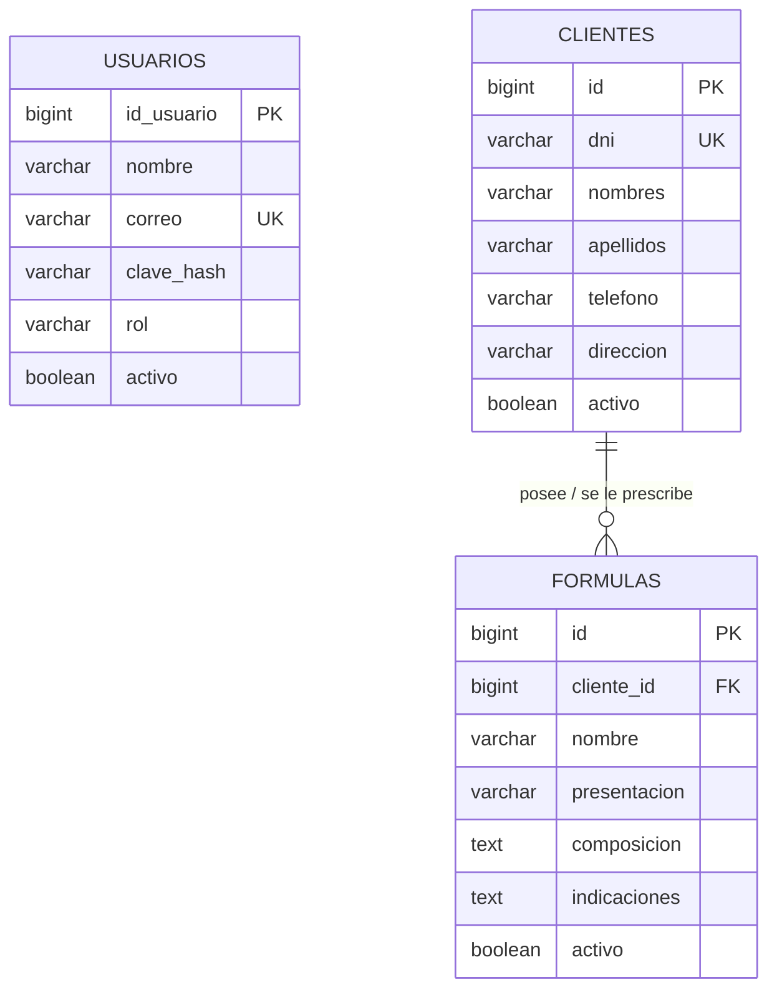

# DOCUMENTACIÓN TÉCNICA Y FUNCIONAL DEL PROYECTO
## Sistema de Gestión de Fórmulas Magistrales y Clientes (DWI)
**Asignatura:** Desarrollo Web Integrado — Ciclo VIII  
**Facultad:** Ingeniería de Sistemas e Informática  
**Versión:** 1.0 (Avance / Primera Entrega)  
**Fecha de Elaboración:** Setiembre de 2026  

---

## ÍNDICE GENERAL
1. [Introducción y Objetivos del Sistema](#1-introducción-y-objetivos-del-sistema)
2. [Arquitectura de Software y Stack Tecnológico](#2-arquitectura-de-software-y-stack-tecnológico)
3. [Estructura del Proyecto y Organización de Paquetes](#3-estructura-del-proyecto-y-organización-de-paquetes)
4. [Módulos Funcionales del Sistema](#4-módulos-funcionales-del-sistema)
   - 4.1. Módulo de Seguridad y Control de Acceso
   - 4.2. Módulo de Gestión de Clientes y Pacientes
   - 4.3. Módulo de Fórmulas Magistrales
   - 4.4. Panel de Control (Dashboard Analítico)
   - 4.5. API REST para Integraciones Móviles / Externas
5. [Integración Externa con RENIEC / ApiCloud](#5-integración-externa-con-reniec--apicloud)
6. [Modelo de Datos y Base de Datos (PostgreSQL 18)](#6-modelo-de-datos-y-base-de-datos-postgresql-18)
7. [Guía de Instalación, Configuración y Despliegue](#7-guía-de-instalación-configuración-y-despliegue)
8. [Auditoría de Calidad y Plan de Aseguramiento (Roadmap)](#8-auditoría-de-calidad-y-plan-de-aseguramiento-roadmap)

---

## 1. INTRODUCCIÓN Y OBJETIVOS DEL SISTEMA

### 1.1. Contexto del Problema
En el rubro farmacéutico y de boticas especializadas, la preparación de **Fórmulas Magistrales** representa una actividad clínica de alta precisión. A diferencia de los medicamentos industrializados, las fórmulas magistrales son medicamentos individualizados prescritos por médicos para atender necesidades específicas de pacientes particulares (concentraciones exactas, vehículos hipoalergénicos, ausencia de conservantes).

Los desafíos críticos detectados en la gestión manual o precaria son:
* **Riesgo de errores en datos de pacientes:** Errores de tipeo en nombres, apellidos o documentos de identidad que comprometen el expediente médico.
* **Falta de trazabilidad:** Dificultad para asociar rápidamente fórmulas prescritas con sus respectivos pacientes y fechas de atención.
* **Seguridad y privacidad clínica:** Almacenamiento no seguro de contraseñas y falta de control de accesos basados en roles para el personal autorizado.

### 1.2. Solución Propuesta
El presente sistema es una plataforma web integral desarrollada sobre **Spring Boot** y **Thymeleaf**, respaldada por el motor de base de datos relacional **PostgreSQL 18**. Automatiza el ciclo completo de registro de pacientes, validando en tiempo real su identidad ante la base de datos oficial del **RENIEC** mediante un servicio en la nube (**ApiCloud / MiAPI Cloud**), y administra las formulaciones químicas con sus posologías y presentaciones farmacéuticas.

---

## 2. ARQUITECTURA DE SOFTWARE Y STACK TECNOLÓGICO

El proyecto sigue una arquitectura en capas basada en el patrón de diseño **MVC (Modelo-Vista-Controlador)** desacoplado, aplicando principios de **Clean Code** e inyección de dependencias.

```
┌────────────────────────────────────────────────────────┐
│                   CAPA DE PRESENTACIÓN                 │
│      Thymeleaf 3 + HTML5 + Bootstrap 5.3 + Vanilla JS  │
└───────────────────────────┬────────────────────────────┘
                            │ HTTP / JSON / Form POST
┌───────────────────────────▼────────────────────────────┐
│                    CAPA CONTROLADORA                   │
│   WebController (Vistas) | Auth/Cliente/Formula REST   │
└───────────────────────────┬────────────────────────────┘
                            │ Inyección de Dependencias
┌───────────────────────────▼────────────────────────────┐
│                    CAPA DE SERVICIO                    │
│   ClienteService | FormulaService | ApiCloudService    │
│   AuthService    | CustomUserDetailsService            │
└───────────────────────────┬────────────────────────────┘
                            │ Spring Data JPA / Hibernate
┌───────────────────────────▼────────────────────────────┐
│                   CAPA DE PERSISTENCIA                 │
│   UsuarioRepository | ClienteRepository | FormulaRepo  │
└───────────────────────────┬────────────────────────────┘
                            │ JDBC Pool (HikariCP)
┌───────────────────────────▼────────────────────────────┐
│                   MOTOR DE BASE DE DATOS               │
│          PostgreSQL 18.1 (Puerto 5433 Local)           │
└────────────────────────────────────────────────────────┘
```

### 2.1. Ficha Técnica de Tecnologías

| Componente | Tecnología | Versión | Justificación Técnica |
| :--- | :--- | :--- | :--- |
| **Lenguaje de Programación** | Java SE | 21 / 22 (LTS) | Uso de records, pattern matching y mejoras en concurrencia y garbage collection. |
| **Framework Base** | Spring Boot | 4.1.1 | Ecosistema empresarial maduro, configuración automática e inyección de dependencias. |
| **Capa Web (MVC)** | Spring MVC + Thymeleaf | 3.x | Renderizado seguro del lado del servidor (SSR), integración nativa con Spring Security y CSRF. |
| **Seguridad** | Spring Security | 6.x | Hasheo BCrypt de credenciales, autenticación por sesión web y Bearer Tokens para API REST. |
| **Persistencia / ORM** | Spring Data JPA + Hibernate | 7.x | Mapeo objeto-relacional robusto, repositorios tipados y control transaccional (`@Transactional`). |
| **Base de Datos Principal** | PostgreSQL | 18.1 (Puerto 5433) | Motor relacional ACID de alto rendimiento, soporte transaccional y llaves foráneas estrictas. |
| **Base de Datos de Pruebas** | H2 Database | En memoria | Entorno aislado y reproducible para pruebas automatizadas con Maven (`./mvnw test`). |
| **Librería de Diseño** | Bootstrap + Bootstrap Icons | 5.3.3 | Interfaz adaptativa (Responsive Web Design) con modales, tarjetas, badges y tipografía legible. |
| **Consumo de API Externa** | Spring RestClient | 6.x | Cliente HTTP síncrono moderno y eficiente para consumir servicios REST externos. |

---

## 3. ESTRUCTURA DEL PROYECTO Y ORGANIZACIÓN DE PAQUETES

El código fuente reside en `src/main/java/com/example/DWI/` y se encuentra rigurosamente segmentado por responsabilidades:

```
com.example.DWI/
│
├── config/                          <- Configuración transversal y beans del sistema
│   ├── BearerTokenFilter.java       <- Filtro HTTP para validar tokens Bearer en rutas /api/**
│   ├── DataInitializer.java        <- Seeder que inicializa el usuario ADMIN en la BD al arrancar
│   ├── PasswordEncoderConfig.java  <- Bean centralizado para el cifrado BCrypt
│   └── SecurityConfig.java         <- Configuración de cadenas de seguridad (Web y REST)
│
├── controller/                      <- Controladores web y REST
│   ├── AuthController.java          <- Endpoints REST /api/auth/login y logout
│   ├── ClienteController.java       <- Endpoints REST /api/clientes (CRUD JSON)
│   ├── FormulaController.java       <- Endpoints REST /api/formulas (CRUD JSON)
│   └── WebController.java           <- Controlador maestro de vistas web Thymeleaf
│
├── model/                           <- Entidades JPA mapeadas a las tablas de PostgreSQL
│   ├── Cliente.java                 <- Entidad cliente/paciente
│   ├── Formula.java                 <- Entidad fórmula magistral (relación @ManyToOne)
│   └── Usuario.java                 <- Entidad usuario administrativo del sistema
│
├── repository/                      <- Interfaces Spring Data JPA
│   ├── ClienteRepository.java       <- Operaciones de BD para clientes (validación de DNI único)
│   ├── FormulaRepository.java       <- Operaciones de BD para fórmulas (conteos y recientes)
│   └── UsuarioRepository.java       <- Operaciones de BD para usuarios (búsqueda por correo)
│
├── service/                         <- Lógica de negocio y servicios de integración
│   ├── ApiCloudService.java         <- Integración HTTP con MiAPI Cloud / RENIEC
│   ├── AuthService.java             <- Gestión de sesiones en memoria para tokens API
│   ├── ClienteService.java          <- Reglas de negocio y transacciones de clientes
│   ├── CustomUserDetailsService.java<- Carga de credenciales y roles desde PostgreSQL
│   └── FormulaService.java          <- Reglas de negocio y transacciones de fórmulas
│
└── DwiApplication.java              <- Clase principal de arranque de Spring Boot
```

### Recursos del Sistema (`src/main/resources/`):
* `static/js/modales.js`: Lógica en JavaScript para la apertura de modales, autocompletado de RENIEC, bloqueo de inputs y reseteo de formularios.
* `templates/`: Plantillas HTML procesadas por el motor Thymeleaf:
  * `dashboard.html`: Panel administrativo principal con métricas.
  * `clientes.html`: Listado de pacientes con tabla dinámica, modal de registro/edición y acciones de estado.
  * `cliente-detalle.html`: Vista de ficha individual del cliente con sus fórmulas asociadas.
  * `formulas.html`: Listado y catálogo de fórmulas magistrales con modal de creación/edición.
  * `formula-detalle.html`: Ficha técnica de la fórmula con composición y modo de uso.
  * `login.html`: Pantalla de autenticación institucional.
  * `fragments.html`: Componentes reutilizables (Sidebar, Topbar dinámico con rol, Scripts compartidos).

---

## 4. MÓDULOS FUNCIONALES DEL SISTEMA

### 4.1. Módulo de Seguridad y Control de Acceso

#### Hasheo Criptográfico de Contraseñas (BCrypt)
Para garantizar la integridad y confidencialidad exigidas por las normas de ciberseguridad, las contraseñas nunca se almacenan en texto plano. En [PasswordEncoderConfig.java](file:///C:/Users/LENOVO/Downloads/UNIVERSIDAD/CICLO%20VIII/Desarrollo%20Web%20Integrado/avance/DWI/DWI/DWI/src/main/java/com/example/DWI/config/PasswordEncoderConfig.java) se configura el bean `BCryptPasswordEncoder`:
* **Generación de Sal (Salt):** Incorpora un salt aleatorio en cada operación de cifrado, impidiendo ataques de diccionario y *rainbow tables*.
* **Función de Derivación de Clave:** Algoritmo adaptativo que mitiga ataques de fuerza bruta.

#### Inicialización Automática del Administrador (Seeding)
La clase [DataInitializer.java](file:///C:/Users/LENOVO/Downloads/UNIVERSIDAD/CICLO%20VIII/Desarrollo%20Web%20Integrado/avance/DWI/DWI/DWI/src/main/java/com/example/DWI/config/DataInitializer.java) implementa `CommandLineRunner`. Al iniciar la aplicación:
1. Consulta la tabla `usuarios` en PostgreSQL buscando el correo `admin@gmail.com`.
2. Si no existe, genera el hash BCrypt de la contraseña `admin123` y persiste al administrador con el rol `ROLE_ADMIN` y estado activo.
3. Si ya existe, omite la creación, respetando la persistencia previa.

#### Doble Cadena de Filtros de Seguridad (`SecurityFilterChain`)
En [SecurityConfig.java](file:///C:/Users/LENOVO/Downloads/UNIVERSIDAD/CICLO%20VIII/Desarrollo%20Web%20Integrado/avance/DWI/DWI/DWI/src/main/java/com/example/DWI/config/SecurityConfig.java) se establecen dos políticas diferenciadas:
1. **Cadena Web (`/`, `/dashboard`, `/clientes/**`, `/formulas/**`):** Utiliza autenticación basada en sesión con formulario (`/login`), protección CSRF activa y redirección al dashboard tras login exitoso.
2. **Cadena REST (`/api/**`):** Política sin estado (`SessionCreationPolicy.STATELESS`), CSRF deshabilitado y validación por cabecera HTTP `Authorization: Bearer <token>` mediante `BearerTokenFilter`.

---

### 4.2. Módulo de Gestión de Clientes y Pacientes

El módulo permite la administración integral de pacientes receptores de formulaciones:
* **Alta con Validación RENIEC:** Ingreso del DNI de 8 dígitos y consulta automática.
* **Bloqueo contra Manipulación:** Una vez que los datos oficiales son recuperados desde la API, los campos de `nombres` y `apellidos` quedan en modo solo lectura (`readOnly = true`) con retroalimentación visual (`bg-secondary-subtle`), evitando la falsificación manual de identidad.
* **Autocompletado de Dirección Domiciliaria:** Captura directamente la dirección reportada por el padrón sin requerir tipeo manual.
* **Control de Duplicidad:** Verificación en base de datos mediante `ClienteRepository.existsByDniAndIdNot` para impedir DNIs duplicados tanto en creación como en edición.
* **Borrado Seguro y Estado Lógico:** Permite deshabilitar temporalmente a un cliente mediante alternancia de estado activo/inactivo (`/clientes/{id}/estado`), impidiendo eliminar físicamente a clientes que cuenten con recetas o fórmulas históricas asociadas (integridad referencial).

---

### 4.3. Módulo de Fórmulas Magistrales

Gestiona las preparaciones farmacéuticas individualizadas:
* **Campos Obligatorios:** Nombre del preparado, forma farmacéutica de presentación (ej. crema, suspensión, cápsulas), principios activos y concentración (composición) e instrucciones posológicas para el paciente.
* **Asociación Clínica:** Relación opcional/directa con un cliente (`@ManyToOne` con clave foránea `cliente_id`), permitiendo registrar tanto fórmulas específicas por paciente como fórmulas estandarizadas de uso frecuente.
* **Ficha Técnica Detallada:** Vista de lectura especializada (`/formulas/{id}`) con impresión de composición química y datos del paciente.

---

### 4.4. Panel de Control (Dashboard Analítico)

Ubicado en `/dashboard`, proporciona visibilidad ejecutiva y métricas operativas al administrador:
* **Total de Clientes:** Conteo general de pacientes registrados.
* **Total de Fórmulas:** Cantidad global de preparaciones registradas.
* **Pacientes con Recetas Activas:** Conteo de clientes únicos con formulaciones asignadas.
* **Últimas Fórmulas:** Tabla con las últimas 5 prescripciones elaboradas en el sistema.

---

### 4.5. API REST para Integraciones Externas

El sistema provee una API completa bajo el prefijo `/api/`:

| Método | Endpoint | Descripción | Autenticación |
| :--- | :--- | :--- | :--- |
| `POST` | `/api/auth/login` | Inicia sesión y retorna token Bearer temporal | Pública |
| `POST` | `/api/auth/logout` | Invalida el token Bearer en el servidor | Bearer Token |
| `GET` | `/api/clientes` | Retorna listado completo de clientes en JSON | Bearer Token |
| `GET` | `/api/clientes/{id}` | Retorna datos individuales de un cliente | Bearer Token |
| `POST` | `/api/clientes` | Registra un nuevo cliente mediante payload JSON | Bearer Token |
| `PUT` | `/api/clientes/{id}` | Actualiza datos de un cliente existente | Bearer Token |
| `DELETE`| `/api/clientes/{id}` | Elimina cliente (si no tiene fórmulas ligadas)| Bearer Token |
| `PATCH` | `/api/clientes/{id}/estado`| Alterna estado activo/inactivo del cliente | Bearer Token |
| `GET` | `/api/formulas` | Retorna listado de fórmulas magistrales | Bearer Token |
| `GET` | `/api/formulas/{id}` | Retorna ficha técnica de una fórmula en JSON | Bearer Token |
| `POST` | `/api/formulas` | Registra una fórmula vinculada a un cliente | Bearer Token |
| `PUT` | `/api/formulas/{id}` | Modifica una fórmula magistral | Bearer Token |
| `DELETE`| `/api/formulas/{id}` | Elimina una fórmula | Bearer Token |

---

## 5. INTEGRACIÓN EXTERNA CON RENIEC / APICLOUD

### 5.1. Proveedor y Protocolo
* **Servicio Proveedor:** MiAPI Cloud / ApiCloud (`https://miapi.cloud/v1`).
* **Endpoint de Consulta:** `GET /v1/dni/{dni}`.
* **Cabecera de Autenticación:** `Authorization: Bearer <TU_TOKEN_RENIEC>`.

### 5.2. Flujo de Ejecución de Consulta
```
[ Usuario ingresa DNI en Modal ]
              │
              ▼ (Clic en "Buscar DNI")
[ JavaScript modales.js ] ───(Fetch)───► [ Backend Spring Boot /clientes/dni/{dni} ]
                                                        │
                                                        ▼ (RestClient con Bearer)
                                         [ ApiCloud Remoto: https://miapi.cloud/v1/dni/{dni} ]
                                                        │
                                                        ▼ (Respuesta JSON)
[ Llena nombres, apellidos y dirección ] ◄───(JSON)──── [ Backend responde al navegador ]
              │
              ▼
[ Bloqueo readOnly = true en Nombres y Apellidos ]
```

### 5.3. Mapeo de Estructura de Datos
La API devuelve el siguiente esquema JSON:
```json
{
  "success": true,
  "datos": {
    "dni": "78569845",
    "nombres": "AILEEN AYELÉN",
    "ape_paterno": "FELIX",
    "ape_materno": "ORTIZ",
    "domiciliado": {
      "direccion": "CL. MARISCAL BENAVIDES NRO.190",
      "distrito": "SUNAMPE",
      "provincia": "CHINCHA",
      "departamento": "ICA",
      "ubigeo": "110210"
    }
  }
}
```
* **Nombres:** Se extrae directamente de `datos.nombres`.
* **Apellidos:** Se combinan `datos.ape_paterno` + `datos.ape_materno`.
* **Dirección Exacta:** Se extrae específicamente de `datos.domiciliado.direccion`, respetando la indicación de no concatenar distrito ni departamento para mantener la dirección limpia en el formulario.

---

## 6. MODELO DE DATOS Y BASE DE DATOS (POSTGRESQL 18)

### 6.1. Diagrama Entidad-Relación (ER)



### 6.2. Diccionario de Datos

#### Tabla: `usuarios`
Almacena las credenciales de acceso administrativo del sistema.
* `id_usuario` (BIGSERIAL, PK): Identificador secuencial único.
* `nombre` (VARCHAR 150, NOT NULL): Nombre completo o descripción del operador.
* `correo` (VARCHAR 254, NOT NULL, UNIQUE): Credencial de acceso (login).
* `clave_hash` (VARCHAR 255, NOT NULL): Contraseña encriptada bajo algoritmo BCrypt.
* `rol` (VARCHAR 50, NOT NULL): Rol de autorización (`ROLE_ADMIN`).
* `activo` (BOOLEAN, DEFAULT TRUE): Estado operativo del usuario.

#### Tabla: `clientes`
Almacena la información de los pacientes y receptores farmacéuticos.
* `id` (BIGSERIAL, PK): Identificador interno del cliente.
* `dni` (VARCHAR 8, NOT NULL, UNIQUE): Documento Nacional de Identidad oficial.
* `nombres` (VARCHAR 100, NOT NULL): Nombres del ciudadano provenientes de RENIEC.
* `apellidos` (VARCHAR 100, NOT NULL): Apellidos paterno y materno.
* `telefono` (VARCHAR 20, NOT NULL): Teléfono de contacto o celular.
* `direccion` (VARCHAR 250, NOT NULL): Dirección domiciliaria reportada.
* `activo` (BOOLEAN, DEFAULT TRUE): Estado habilitado/deshabilitado.

#### Tabla: `formulas`
Registra las recetas y preparaciones magistrales elaboradas.
* `id` (BIGSERIAL, PK): Identificador único de la fórmula.
* `cliente_id` (BIGINT, FK nullable): Clave foránea referenciando a `clientes(id)`.
* `nombre` (VARCHAR 120, NOT NULL): Denominación del preparado magistral.
* `presentacion` (VARCHAR 100, NOT NULL): Forma farmacéutica (Ungüento, Pomada, Solución, etc.).
* `composicion` (TEXT / VARCHAR 4000, NOT NULL): Principios activos, concentraciones e insumos.
* `indicaciones` (TEXT / VARCHAR 4000, NOT NULL): Modo de empleo y posología recomendada.
* `activo` (BOOLEAN, DEFAULT TRUE): Estado de la fórmula.

---

## 7. GUÍA DE INSTALACIÓN, CONFIGURACIÓN Y DESPLIEGUE

### 7.1. Requisitos Previos del Sistema
1. **Java Development Kit (JDK):** Versión 21 o superior debidamente configurada en la variable `JAVA_HOME`.
2. **Motor de Base de Datos:** PostgreSQL 18 instalado y en ejecución en el puerto `5433`.
3. **Gestor de Construcción:** Maven (incluido wrapper `./mvnw.cmd` dentro del repositorio).

### 7.2. Configuración de Base de Datos en PostgreSQL 18
Verificar la existencia de la base de datos `Magistral_Formulas` en PostgreSQL 18:
```sql
CREATE DATABASE "Magistral_Formulas"
    WITH OWNER = postgres
    ENCODING = 'UTF8'
    CONNECTION LIMIT = -1;
```

### 7.3. Configuración para Colaboradores (Paso a Paso)

Cuando un colaborador clona el repositorio, para que el proyecto le corra en su computadora debe seguir estos **3 pasos**:

1. **Crear la Base de Datos:**
   Ejecutar el script `bd_formulas_magistrales_postgresql.sql` en su PostgreSQL (pgAdmin o DBeaver) para crear la base de datos `Magistral_Formulas`.

2. **Crear su archivo de configuración local:**
   Copiar la plantilla `application-local.properties.example` y renombrarla como `application-local.properties`:
   ```powershell
   Copy-Item application-local.properties.example application-local.properties
   ```

3. **Ajustar sus credenciales en `application-local.properties`:**
   Abrir ese archivo y colocar su propia contraseña de PostgreSQL, el puerto (`5432` o `5433`) y el token de RENIEC:
   ```properties
   spring.datasource.url=jdbc:postgresql://localhost:5432/Magistral_Formulas
   spring.datasource.username=postgres
   spring.datasource.password=su_password_de_postgres
   apicloud.reniec.token=token_compartido_o_propio
   ```
   *(Este archivo `application-local.properties` está en `.gitignore`, por lo que sus datos personales nunca se subirán a GitHub).*


### 7.4. Comandos de Compilación y Ejecución

* **Compilar y ejecutar suite de pruebas automatizadas:**
  ```powershell
  ./mvnw.cmd clean test
  ```
  *(Verifica la creación del esquema en H2, la inyección de dependencias y el seeder de seguridad).*

* **Iniciar el servidor web en desarrollo:**
  ```powershell
  ./mvnw.cmd spring-boot:run
  ```
  *(La aplicación levantará en el puerto `8080` de Tomcat).*

### 7.5. Credenciales Iniciales de Acceso
* **URL de Acceso Web:** `http://localhost:8080/login`
* **Correo:** `admin@gmail.com`
* **Contraseña:** `admin123`

---

## 8. AUDITORÍA DE CALIDAD Y PLAN DE ASEGURAMIENTO (ROADMAP)

Como parte de las buenas prácticas de ingeniería de software para las siguientes fases de entrega, se han establecido los siguientes puntos de optimización continua:

1. **Gestión de Secretos en Entornos de Producción:**
   - Separación estricta de credenciales de desarrollo mediante variables de entorno del sistema operativo (`DB_PASSWORD`, `RENIEC_API_TOKEN`), manteniendo el archivo `application-local.properties` protegido en `.gitignore`.
2. **Prevención de Mass Assignment / IDOR mediante DTOs:**
   - Implementación de `ClienteForm` y `FormulaForm` con exclusión del campo `activo`, garantizando que las modificaciones de estado únicamente se procesen por sus endpoints de control auditados.
3. **Manejo Centralizado de Excepciones Web (`@ControllerAdvice`):**
   - Intercepción de errores HTTP 404/409/500 con redirección amigable y mensajes Flash contextuales de Bootstrap en la interfaz de usuario.
4. **Optimización de Consultas N+1 en JPA:**
   - Incorporación de `@EntityGraph(attributePaths = "cliente")` en `FormulaRepository` para resolver la carga ansiosa de pacientes en una sola consulta relacional optimizada (`LEFT JOIN`).
5. **Mantenimiento Programado de Sesiones en Memoria (`@Scheduled`):**
   - Incorporación de una tarea periódica de limpieza en segundo plano para purgar tokens de autenticación vencidos y preservar la memoria del servidor.

---
*Documentación generada formalmente para la entrega del Avance de Proyecto — Desarrollo Web Integrado (Ciclo VIII).*
