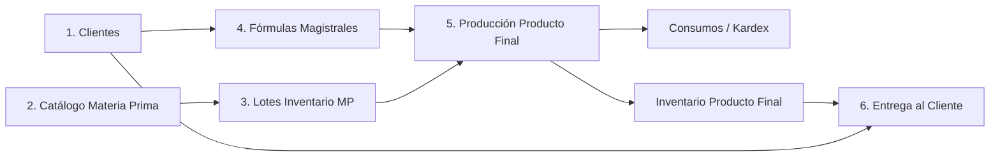

# Sistema de Gestión de Fórmulas Magistrales y Trazabilidad Farmacéutica

API REST construida con **Spring Boot** (Java 21) y **PostgreSQL** para la formulación magistral, control estricto de inventarios de lotes, gestión de consumos para producción y entrega de preparados a clientes/pacientes.

---

## 📌 Arquitectura del Negocio y Flujo de Procesos

El sistema modela fielmente las Buenas Prácticas de Manufactura Farmacéutica (BPM) y la trazabilidad de inventarios (Kardex):



1. **Clientes (`/api/clientes`):** Registro y consulta de pacientes receptores de las fórmulas, con integración DNI.
2. **Materias Primas (`/api/materias-primas`):** Catálogo maestro de insumos químicos y naturales (glicerina, karité, agua, escualano, etc.).
3. **Inventario Materia Prima (`/api/inventario/materia-prima`):** Registro de lotes físicos recibidos con fecha de ingreso y stock inicial. Admite ingreso individual y masivo (`/masivo`).
4. **Fórmulas Magistrales (`/api/formulas`):** Definición de recetas médicas con sus respectivas materias primas, proporciones y rendimiento (`/importar`).
5. **Producción (`/api/inventario/producto-final`):** Fabricación de preparados terminados consumiendo y descontando progresivamente el stock de los lotes seleccionados.
6. **Consumos / Trazabilidad (`/api/consumos`):** Auditoría inmutable generada automáticamente que vincula cada lote de materia prima consumido con el lote de producto final elaborado.
7. **Entregas (`/api/entregas`):** Despacho del producto terminado al paciente con validaciones de receta personalizada y actualización del stock remanente.

---

## 🚀 Requisitos y Configuración

- **Java JDK:** 21 o superior
- **Base de Datos:** PostgreSQL 17+ (puerto por defecto `5432`)
- **Gestor de Construcción:** Maven Wrapper incluido (`mvnw.cmd` / `./mvnw`)

### Configuración en `src/main/resources/application.properties`

```properties
spring.application.name=DWI
spring.datasource.url=jdbc:postgresql://localhost:5432/Formulas_magistrales
spring.datasource.username=postgres
spring.datasource.password=tu_password_aqui
spring.datasource.driver-class-name=org.postgresql.Driver
spring.jpa.hibernate.ddl-auto=update
spring.jpa.show-sql=false
spring.jpa.properties.hibernate.format_sql=true
```

---

## 🗄️ Restauración de Base de Datos

El repositorio incluye el archivo de respaldo `base_dwi.sql` con datos completos (62 materias primas, 65 lotes de stock, 12 fórmulas iniciales):

```powershell
# Crear la base de datos en PostgreSQL
createdb -U postgres Formulas_magistrales

# Restaurar el dump personalizado
pg_restore -U postgres -d Formulas_magistrales base_dwi.sql
```

---

## 📖 Colección de Endpoints Principales (Postman)

### 1. Clientes
- `GET /api/clientes` - Listar todos los clientes.
- `GET /api/clientes/{id}` - Obtener cliente por ID.
- `POST /api/clientes` - Registrar nuevo cliente.

### 2. Materias Primas
- `GET /api/materias-primas` - Listar catálogo de insumos.
- `GET /api/materias-primas/{id}` - Consultar materia prima por ID.
- `POST /api/materias-primas` - Registrar nuevo insumo.

### 3. Inventario Materia Prima (Lotes)
- `GET /api/inventario/materia-prima` - Listar todos los lotes y stocks.
- `GET /api/inventario/materia-prima/{id}` - Detalle de lote por ID.
- `POST /api/inventario/materia-prima` - Ingresar un lote individual.
- `POST /api/inventario/materia-prima/masivo` - Carga masiva de lotes en arreglo `[...]`.

### 4. Fórmulas Magistrales
- `GET /api/formulas` - Listar fórmulas y sus ingredientes.
- `GET /api/formulas/{id}` - Consultar fórmula por ID.
- `POST /api/formulas/importar` - Crear fórmula con todos sus ingredientes vinculados.
- `PUT /api/formulas/{id}` - Modificar datos descriptivos (solo si no tiene producción previa).
- `DELETE /api/formulas/{id}` - Alternar estado activo / inactivo (borrado lógico).

### 5. Producción
- `GET /api/inventario/producto-final` - Listar productos terminados disponibles.
- `POST /api/inventario/producto-final` - Fabricar producto final descontando insumos.

### 6. Consumos (Trazabilidad / Kardex)
- `GET /api/consumos` - Listar auditoría de consumos de materias primas.
- `GET /api/consumos/{id}` - Detalle de consumo.

### 7. Entregas
- `GET /api/entregas` - Historial de despachos a pacientes.
- `POST /api/entregas` - Despachar medicamento y descontar stock final.

---

## ⚙️ Ejecución del Proyecto

```powershell
./mvnw.cmd spring-boot:run
```
Servidor disponible en: `http://localhost:8080`
